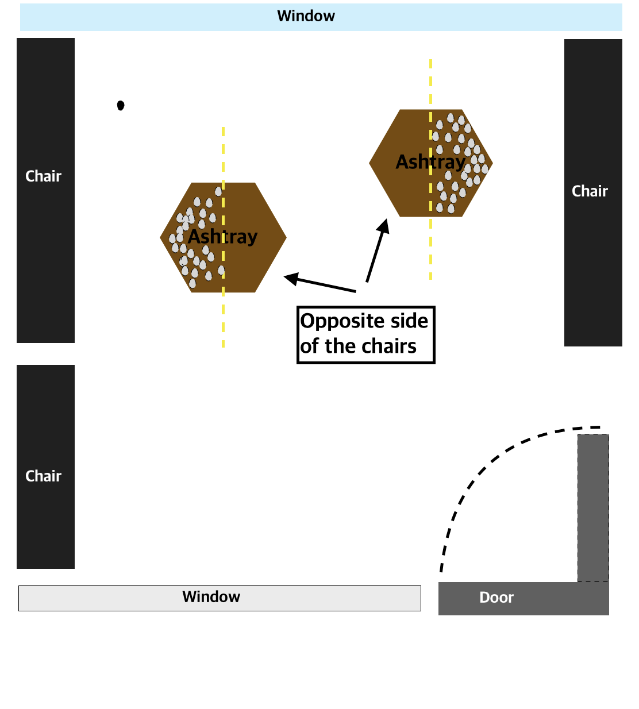

# Inspirations
list of inspirations that i caught in daily life

1. Point of view for analyzing data 

- Smoking room

I have one cafe that i usally go to study near my home.  
This cafe is consisted with 2 floor - 1F is for cashier and 2F is for seats and smoking room.  
Because i am a smoking person, i need to smoke regularlly even more when i'm studying(Just for encouraging concentration haha).  
So this place is so nice for me. For me, Smoking time gives many good affects.  
Usally it gives me a break time, relieves my stess, organizes my thought and sometimes gives me an opportunity for deep thinking. 
So this cafe's smoking room is my favorite place.  
 
One day i had been this cafe with my friend and go smoking room together.  
There is two big ashtray and 6 chairs. When i was smoking in there, sometimes i just caught many brands of cigarettes in ashtray and thought about people's preference cigarette brand.  
It's a kinda occupational disease that analyzing data and figuring out meaningful result haha.  
But this thought was not interesting to me becaus i thought anybody can think about it when they saw ashtray.  
 
My friend (who is not concerned with my major even with studying haha) told me something very fresh.  
(before we get started, here is picture to help your understanding with smoking room's view)
 

Freind : "Did you see? Everyone didn't threw their cigarette into the ashtray on the opposite side of the chairs!" 
Me : "What? Oh i see. yeah it's true. There are no cigarettes at ashtray on the side which are not looking for chairs. but so what?" 
Friend : "It means everybody smoked and threw away their cigarretes while sitting. and nobody didn't smoked while standing" 
Me : Oh my goodness... it's a kinda fresh shocking man..." 
 
Yeah it was quite fresh result with analyzing that place.  
I just always thought about people's preference cigarette brand with counting several cigarattes. and my friend thought was so fresh and new to me. 
With this episode, i realized point of view for analzing and wathching data is so important.  
One of data scientist's needed ability is wide perspective to interpret and analyze data.  
As You saw above, various perspective(point of view) can make various thinking and interpretation. 
With various interpretation, data scientists can make good decisions for something. 
So im gonna find a way for widening perspective to interpret something and do that way. 
Maybe i think one of that way is reading books. Also talk with diverse people and notice how they see the world. 
